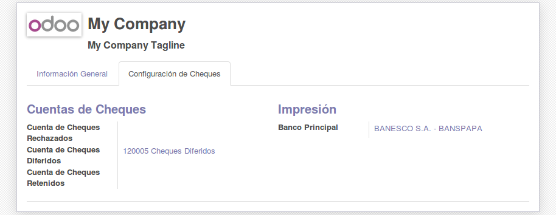

.. image:: https://img.shields.io/badge/licence-AGPL--3-blue.svg
   :target: http://www.gnu.org/licenses/agpl-3.0-standalone.html
   :alt: License: AGPL-3

Checks Management
=================

Este módulo agrega administración de cheques incluyendo funcionalidad para cheques propios y de terceros.

Configuración
-------------

La configuración de cheques se consigue en ``Configuración`` > ``Usuarios`` >
``Compañías``, se debe seleccionar la compañía y ajustar lo necesario:

* Se deben configurar las cuentas contables para cada tipo de cheque

  - Cuenta de Cheques Rechazados
  - Cuenta de Cheques Diferidos
  - Cuenta de Cheques Retenidos

* Es recomendable asignar un banco principal del cual se emitirán los cheques propios de la empresa

  - Banco Principal

* Si no se asigna un banco principal por compañía, cada cheque propio debe tener asignado el banco, esto para fines de impresión

Uso
---

* Impresión de Cheques Propios: Los mismos salen en formato Pre-Impreso

  .. image:: static/src/img/print_button.png
     :alt: Botón Imprimir
     :align: center

  1. Seleccionar el cheque propio en la vista de cheques
  2. El cheque debe tener estado `Handed` o `Debitado` para que se habilite el botón de impresión
  3. Si no tiene asignado un banco, y no hay banco principal, saldrá una alerta para configurarlo.

    .. image:: static/src/img/company_redirect.png
       :alt: Alerta de Configuración de Banco
       :align: center

  4. Si el banco no tiene implementado la función para imprimir el pre-impreso, arrojará una alerta

    .. image:: static/src/img/bank_not_implemented.png
       :alt: Alerta Banco no implementado
       :align: center

Maintainer
----------

.. image:: http://falconsolutions.cl/wp-content/uploads/2017/02/fs-1.png
   :alt: Falcon Solutions SpA
   :target: http://www.falconsolutions.cl

This module is maintained by Falcon Solutions SpA.
